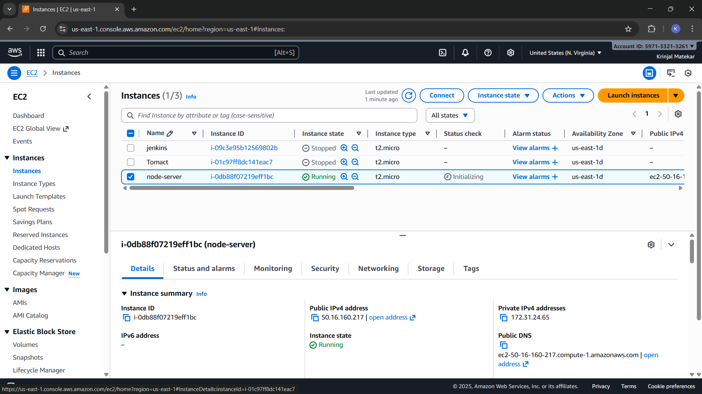
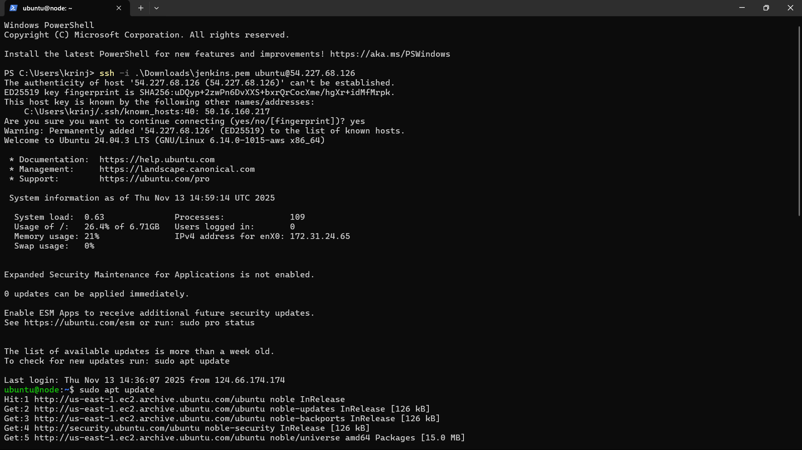
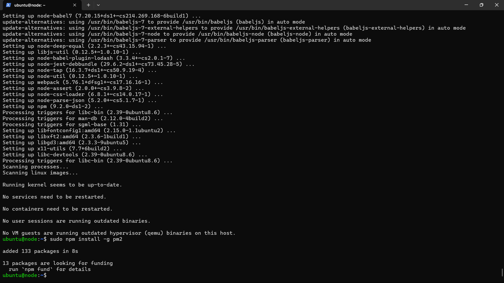
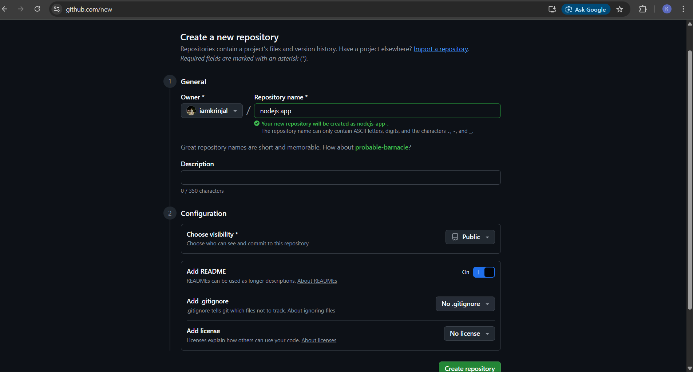
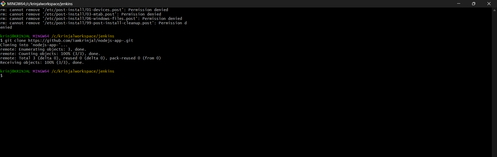
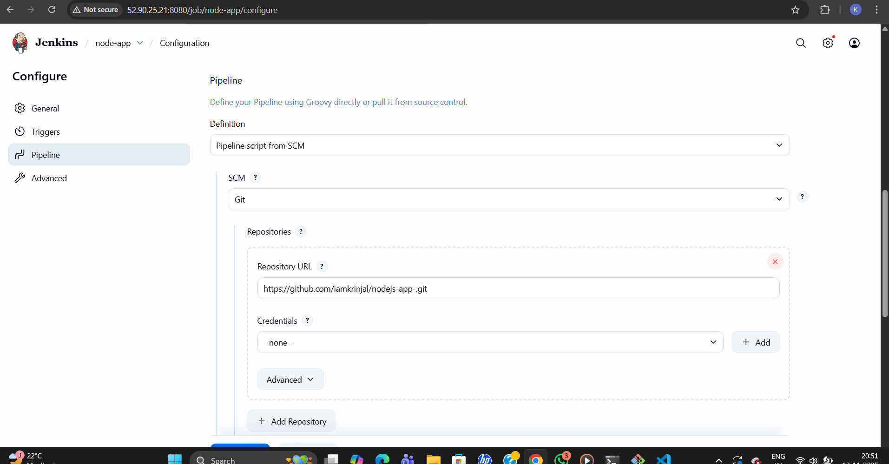
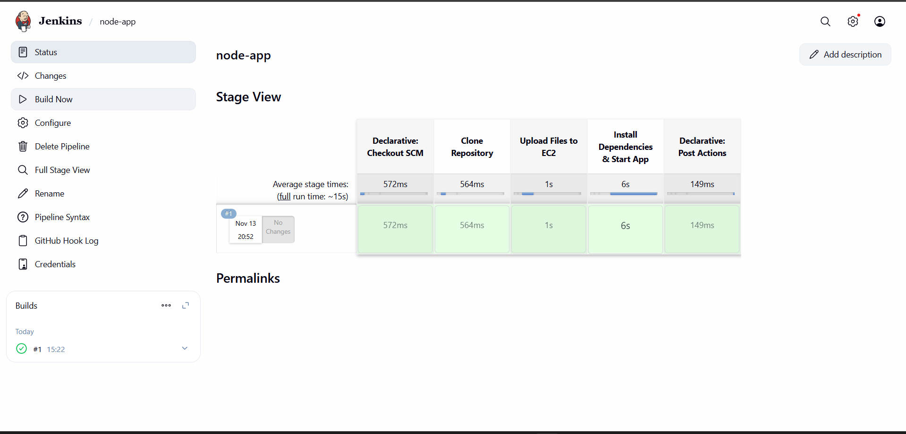

# Nodejs-Demo-app

 This project demonstrates how to automate the deployment process of an application using GitHub Actions CI/CD Pipeline.

The main goal is to achieve continuous integration and continuous deployment, where every code push automatically triggers a build, test, and deployment process.
By implementing this pipeline, manual deployment steps are eliminated — ensuring faster, consistent, and error-free deployments.

## Step 1: Launch Instance

Create Instance 

## Step 2: Connect to AWS EC2 Instance Install Node.js and PM2 on EC2 Instance 

 

Update Packages : 
```bash
sudo apt update
````
Install Node.js and npm :
```bash
sudo apt install nodejs npm -y
````
Install PM2 Globally :

PM2 helps you manage and keep your Node.js app running in the background.
```bash
sudo npm install -g pm2
````


## step 3: Create Repository on Github

In this step, we create a GitHub repository to store our Node.js project code and integrate it with the CI/CD pipeline later.

🔹 Steps to Create Repository:

1. Go to https://github.com/new
.

2. Enter your repository name (for example: nodejs-app).

3. Add an optional description (e.g., “Automate Node.js deployment using CI/CD pipeline”).

4. Choose visibility:

   Public (recommended for demos)
or Private (if it’s a personal project)

5. Enable the option “Add a README file”.

6. Click on Create repository.



## Step 5️ – Clone GitHub Repository
Once your GitHub repository is created, you need to clone it to your git bash here  to start building and deploying your project.


Clone your GitHub repository
Copy your repository’s HTTPS or SSH link from GitHub and run:

git clone https://github.com/iamkrinjal/nodejs-app.git


## Step 6: Create a Jenkins Pipeline Job

Once Jenkins is installed and running, the next step is to create a Pipeline Job to automate your build and deployment process.

1.  Open Jenkins Dashboard
Go to your Jenkins URL in the browser (e.g., http://<your-ec2-ip>:8080).
 
     Click on “New Item” from the Jenkins dashboard.

2.  Create a New Job

    Enter your project name (for example: node-app).

    Select “Pipeline” as the project type.

3. Click on OK to proceed.


## step 7: Add GitHub Credentials in Jenkins

To allow Jenkins to access your GitHub repository securely, we need to configure credentials inside Jenkins.
This ensures Jenkins can pull the code automatically during pipeline execution.

1. Steps to Add Credentials:

    Open Jenkins Dashboard
Go to your Jenkins instance (e.g., http://<your-ec2-ip>:8080).

   Navigate to Credentials
From the left sidebar, click:

   Manage Jenkins → Credentials → System → Global credentials (unrestricted)


2.  Click on "Add Credentials"

3.  Choose Credential Type

    In the form that appears:

    i) Kind: Select Username with password

    ii) Username: Your GitHub username

    iii)Password / Token: Your GitHub Personal Access Token (PAT)

    iv)ID (optional): For example, github-token

    v)Description: “GitHub Access Token for CI/CD”

4. Click Save ✅


## Step 8: Open VS Code

Change the environment 


## Step 9: Create Jenkins Job for Node.js Application

In this step, you will create a Jenkins Pipeline Job named node-app to automate the build and deployment process.

🔹 Steps to Create a Jenkins Job:

1. Open Jenkins Dashboard
Navigate to your Jenkins web interface (e.g., http://<your-ec2-ip>:8080).

2. Click on “New Item” from the left sidebar.

3. Enter Job Name:

node-app


4. Select Project Type:
Choose “Pipeline” and click OK.

5. Add Description (Optional):
Scroll Down to Pipeline Section → Definition

   i)Select Pipeline script from SCM.

   ii) Under SCM, choose Git.

   iii)In the Repository URL field, paste your GitHub repo link:

https://github.com/iamkrinjal/nodejs-app.git


  iv)Under Credentials, select the GitHub token you added earlier.

   v)Branch Specifier:

*/main

vi) Script Path:

Jenkinsfile


6. Click on Save ✅

7. Run the Job

i)  Click Build Now to trigger the first pipeline run.

ii) Jenkins will pull your code from GitHub and execute the steps defined in the Jenkinesfile



## Step 10: Build Code


Once your repository and Jenkins job are ready, it’s time to build your Node.js app locally and push the latest code to GitHub.

## Step 10: 
